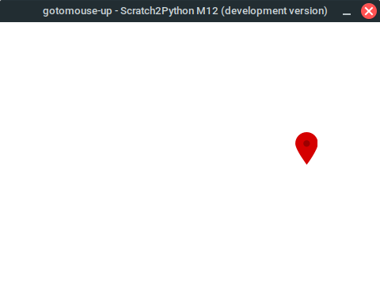

# Scratch2Python
Scratch2Python is a Python program allowing you to run Scratch projects in Python. It is still being worked on, and far from done.

A screenshot of the latest release running on Linux
